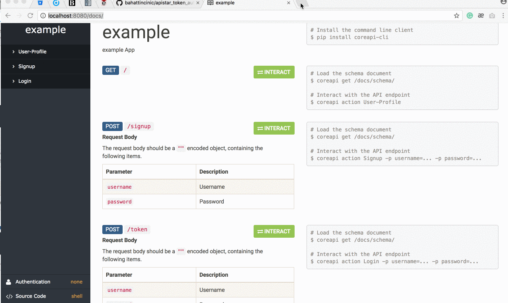

# API Star Token Based Authentication

Token Based Authentication for API Star

[](https://badge.fury.io/py/apistar-token-auth)



## Installation

```
$ pip install apistar-token-auth
```

# Docs
- [Django Setup](docs/DJANGO_SETUP.md)
- [SQLAlchemy Setup](docs/SQLALCHEMY_SETUP.md)
- [Configuration](docs/CONFIGURATION.md)

## Example

- [Django Example](examples/django)
- [SQLAlchemy Example](examples/sqlalchemy)
